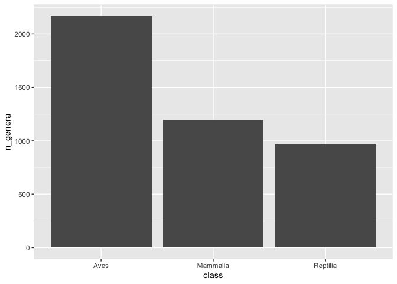
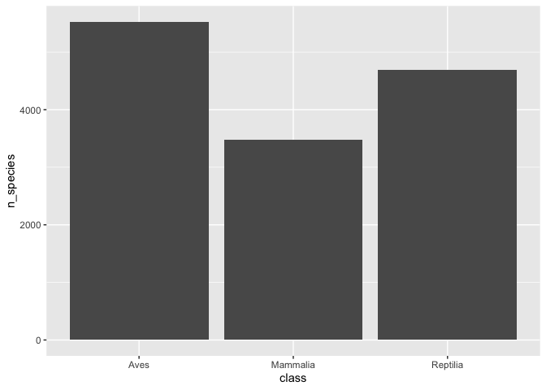
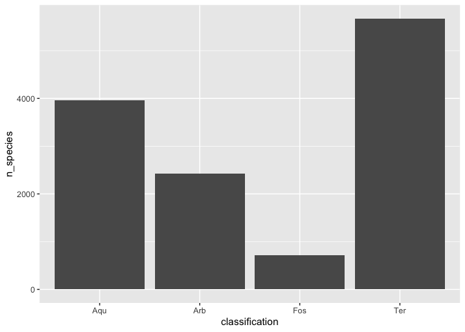
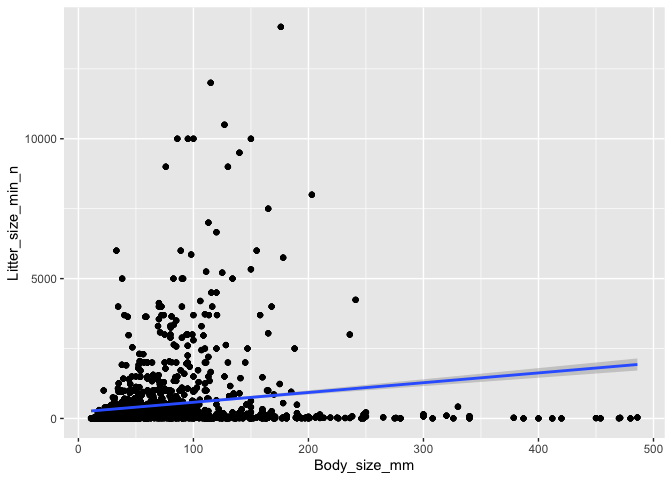

## Instructions
Answer the following questions and complete the exercises in RMarkdown. Please embed all of your code and push your final work to your repository. Your final lab report should be organized, clean, and run free from errors. Remember, you must remove the `#` for the included code chunks to run.  

## Libraries

```r
library(tidyverse)
```

```
## ── Attaching packages ────────────────────────────────────────────────────────── tidyverse 1.3.0 ──
```

```
## ✓ ggplot2 3.2.1     ✓ purrr   0.3.3
## ✓ tibble  2.1.3     ✓ dplyr   0.8.4
## ✓ tidyr   1.0.2     ✓ stringr 1.4.0
## ✓ readr   1.3.1     ✓ forcats 0.4.0
```

```
## ── Conflicts ───────────────────────────────────────────────────────────── tidyverse_conflicts() ──
## x dplyr::filter() masks stats::filter()
## x dplyr::lag()    masks stats::lag()
```

```r
library(naniar)
library(skimr)
```

```
## 
## Attaching package: 'skimr'
```

```
## The following object is masked from 'package:naniar':
## 
##     n_complete
```

## Data
For this homework, we will use two different data sets. Please load `amniota` and `amphibio`.  

### `amniota` data
Myhrvold N, Baldridge E, Chan B, Sivam D, Freeman DL, Ernest SKM (2015). “An amniote life-history
database to perform comparative analyses with birds, mammals, and reptiles.” _Ecology_, *96*, 3109.
doi: 10.1890/15-0846.1 (URL: https://doi.org/10.1890/15-0846.1).

```r
amniota <- 
  readr::read_csv("data/amniota.csv")
```

```
## Parsed with column specification:
## cols(
##   .default = col_double(),
##   class = col_character(),
##   order = col_character(),
##   family = col_character(),
##   genus = col_character(),
##   species = col_character(),
##   common_name = col_character()
## )
```

```
## See spec(...) for full column specifications.
```

### `amphibio` data
Oliveira BF, São-Pedro VA, Santos-Barrera G, Penone C, Costa GC (2017). “AmphiBIO, a global database
for amphibian ecological traits.” _Scientific Data_, *4*, 170123. doi: 10.1038/sdata.2017.123 (URL:
https://doi.org/10.1038/sdata.2017.123).

```r
amphibio <- 
  readr::read_csv("data/amphibio.csv")
```

```
## Parsed with column specification:
## cols(
##   .default = col_double(),
##   id = col_character(),
##   Order = col_character(),
##   Family = col_character(),
##   Genus = col_character(),
##   Species = col_character(),
##   Seeds = col_logical(),
##   OBS = col_logical()
## )
```

```
## See spec(...) for full column specifications.
```

```
## Warning: 125 parsing failures.
##  row col           expected                                                           actual                file
## 1410 OBS 1/0/T/F/TRUE/FALSE Identified as P. appendiculata in Boquimpani-Freitas et al. 2002 'data/amphibio.csv'
## 1416 OBS 1/0/T/F/TRUE/FALSE Identified as T. miliaris in Giaretta and Facure 2004            'data/amphibio.csv'
## 1447 OBS 1/0/T/F/TRUE/FALSE Considered endangered by Soto-Azat et al. 2013                   'data/amphibio.csv'
## 1448 OBS 1/0/T/F/TRUE/FALSE Considered extinct by Soto-Azat et al. 2013                      'data/amphibio.csv'
## 1471 OBS 1/0/T/F/TRUE/FALSE nomem dubitum                                                    'data/amphibio.csv'
## .... ... .................. ................................................................ ...................
## See problems(...) for more details.
```

## Questions  
**1. First, do some exploratory analysis of both data sets. What is the structure, column names, and dimensions?**  

```r
glimpse(amniota)
```

```
## Observations: 21,322
## Variables: 36
## $ class                                 <chr> "Aves", "Aves", "Aves", "Aves",…
## $ order                                 <chr> "Accipitriformes", "Accipitrifo…
## $ family                                <chr> "Accipitridae", "Accipitridae",…
## $ genus                                 <chr> "Accipiter", "Accipiter", "Acci…
## $ species                               <chr> "albogularis", "badius", "bicol…
## $ subspecies                            <dbl> -999, -999, -999, -999, -999, -…
## $ common_name                           <chr> "Pied Goshawk", "Shikra", "Bico…
## $ female_maturity_d                     <dbl> -999.000, 363.468, -999.000, -9…
## $ litter_or_clutch_size_n               <dbl> -999.000, 3.250, 2.700, -999.00…
## $ litters_or_clutches_per_y             <dbl> -999, 1, -999, -999, 1, -999, -…
## $ adult_body_mass_g                     <dbl> 251.500, 140.000, 345.000, 142.…
## $ maximum_longevity_y                   <dbl> -999.00000, -999.00000, -999.00…
## $ gestation_d                           <dbl> -999, -999, -999, -999, -999, -…
## $ weaning_d                             <dbl> -999, -999, -999, -999, -999, -…
## $ birth_or_hatching_weight_g            <dbl> -999, -999, -999, -999, -999, -…
## $ weaning_weight_g                      <dbl> -999, -999, -999, -999, -999, -…
## $ egg_mass_g                            <dbl> -999.00, 21.00, 32.00, -999.00,…
## $ incubation_d                          <dbl> -999.00, 30.00, -999.00, -999.0…
## $ fledging_age_d                        <dbl> -999.00, 32.00, -999.00, -999.0…
## $ longevity_y                           <dbl> -999.00000, -999.00000, -999.00…
## $ male_maturity_d                       <dbl> -999, -999, -999, -999, -999, -…
## $ inter_litter_or_interbirth_interval_y <dbl> -999, -999, -999, -999, -999, -…
## $ female_body_mass_g                    <dbl> 352.500, 168.500, 390.000, -999…
## $ male_body_mass_g                      <dbl> 223.000, 125.000, 212.000, 142.…
## $ no_sex_body_mass_g                    <dbl> -999.0, 123.0, -999.0, -999.0, …
## $ egg_width_mm                          <dbl> -999, -999, -999, -999, -999, -…
## $ egg_length_mm                         <dbl> -999, -999, -999, -999, -999, -…
## $ fledging_mass_g                       <dbl> -999, -999, -999, -999, -999, -…
## $ adult_svl_cm                          <dbl> -999.00, 30.00, 39.50, -999.00,…
## $ male_svl_cm                           <dbl> -999, -999, -999, -999, -999, -…
## $ female_svl_cm                         <dbl> -999, -999, -999, -999, -999, -…
## $ birth_or_hatching_svl_cm              <dbl> -999, -999, -999, -999, -999, -…
## $ female_svl_at_maturity_cm             <dbl> -999, -999, -999, -999, -999, -…
## $ female_body_mass_at_maturity_g        <dbl> -999, -999, -999, -999, -999, -…
## $ no_sex_svl_cm                         <dbl> -999, -999, -999, -999, -999, -…
## $ no_sex_maturity_d                     <dbl> -999, -999, -999, -999, -999, -…
```

```r
colnames(amniota)
```

```
##  [1] "class"                                
##  [2] "order"                                
##  [3] "family"                               
##  [4] "genus"                                
##  [5] "species"                              
##  [6] "subspecies"                           
##  [7] "common_name"                          
##  [8] "female_maturity_d"                    
##  [9] "litter_or_clutch_size_n"              
## [10] "litters_or_clutches_per_y"            
## [11] "adult_body_mass_g"                    
## [12] "maximum_longevity_y"                  
## [13] "gestation_d"                          
## [14] "weaning_d"                            
## [15] "birth_or_hatching_weight_g"           
## [16] "weaning_weight_g"                     
## [17] "egg_mass_g"                           
## [18] "incubation_d"                         
## [19] "fledging_age_d"                       
## [20] "longevity_y"                          
## [21] "male_maturity_d"                      
## [22] "inter_litter_or_interbirth_interval_y"
## [23] "female_body_mass_g"                   
## [24] "male_body_mass_g"                     
## [25] "no_sex_body_mass_g"                   
## [26] "egg_width_mm"                         
## [27] "egg_length_mm"                        
## [28] "fledging_mass_g"                      
## [29] "adult_svl_cm"                         
## [30] "male_svl_cm"                          
## [31] "female_svl_cm"                        
## [32] "birth_or_hatching_svl_cm"             
## [33] "female_svl_at_maturity_cm"            
## [34] "female_body_mass_at_maturity_g"       
## [35] "no_sex_svl_cm"                        
## [36] "no_sex_maturity_d"
```


```r
glimpse(amphibio)
```

```
## Observations: 6,776
## Variables: 38
## $ id                      <chr> "Anf0001", "Anf0002", "Anf0003", "Anf0004", "…
## $ Order                   <chr> "Anura", "Anura", "Anura", "Anura", "Anura", …
## $ Family                  <chr> "Allophrynidae", "Alytidae", "Alytidae", "Aly…
## $ Genus                   <chr> "Allophryne", "Alytes", "Alytes", "Alytes", "…
## $ Species                 <chr> "Allophryne ruthveni", "Alytes cisternasii", …
## $ Fos                     <dbl> NA, NA, NA, NA, NA, 1, 1, 1, 1, 1, 1, 1, 1, N…
## $ Ter                     <dbl> 1, 1, 1, 1, 1, 1, 1, 1, 1, 1, 1, 1, 1, 1, 1, …
## $ Aqu                     <dbl> 1, 1, 1, 1, NA, 1, 1, 1, 1, 1, 1, 1, 1, 1, 1,…
## $ Arb                     <dbl> 1, 1, 1, 1, 1, 1, NA, NA, NA, NA, NA, NA, NA,…
## $ Leaves                  <dbl> NA, NA, NA, NA, NA, NA, NA, NA, NA, NA, NA, N…
## $ Flowers                 <dbl> NA, NA, NA, NA, NA, NA, NA, NA, NA, NA, NA, N…
## $ Seeds                   <lgl> NA, NA, NA, NA, NA, NA, NA, NA, NA, NA, NA, N…
## $ Fruits                  <dbl> NA, NA, NA, NA, NA, NA, NA, NA, NA, NA, NA, N…
## $ Arthro                  <dbl> 1, 1, 1, NA, 1, 1, 1, 1, 1, NA, 1, 1, NA, NA,…
## $ Vert                    <dbl> NA, NA, NA, NA, NA, NA, 1, NA, NA, NA, 1, 1, …
## $ Diu                     <dbl> 1, NA, NA, NA, NA, NA, 1, 1, 1, NA, 1, 1, NA,…
## $ Noc                     <dbl> 1, 1, 1, NA, 1, 1, 1, 1, 1, NA, 1, 1, 1, NA, …
## $ Crepu                   <dbl> 1, NA, NA, NA, NA, 1, NA, NA, NA, NA, NA, NA,…
## $ Wet_warm                <dbl> NA, NA, NA, NA, 1, 1, NA, NA, NA, NA, 1, NA, …
## $ Wet_cold                <dbl> 1, NA, NA, NA, NA, NA, 1, NA, NA, NA, NA, NA,…
## $ Dry_warm                <dbl> NA, NA, NA, NA, NA, NA, NA, NA, NA, NA, NA, N…
## $ Dry_cold                <dbl> NA, NA, NA, NA, NA, NA, NA, NA, NA, NA, NA, N…
## $ Body_mass_g             <dbl> 31.00, 6.10, NA, NA, 2.31, 13.40, 21.80, NA, …
## $ Age_at_maturity_min_y   <dbl> NA, 2.0, 2.0, NA, 3.0, 2.0, 3.0, NA, NA, NA, …
## $ Age_at_maturity_max_y   <dbl> NA, 2.0, 2.0, NA, 3.0, 3.0, 5.0, NA, NA, NA, …
## $ Body_size_mm            <dbl> 31.0, 50.0, 55.0, NA, 40.0, 55.0, 80.0, 60.0,…
## $ Size_at_maturity_min_mm <dbl> NA, 27, NA, NA, NA, 35, NA, NA, NA, NA, NA, N…
## $ Size_at_maturity_max_mm <dbl> NA, 36.0, NA, NA, NA, 40.5, NA, NA, NA, NA, N…
## $ Longevity_max_y         <dbl> NA, 6, NA, NA, NA, 7, 9, NA, NA, NA, NA, NA, …
## $ Litter_size_min_n       <dbl> 300, 60, 40, NA, 7, 53, 300, 1500, 1000, NA, …
## $ Litter_size_max_n       <dbl> 300, 180, 40, NA, 20, 171, 1500, 1500, 1000, …
## $ Reproductive_output_y   <dbl> 1, 4, 1, 4, 1, 4, 6, 1, 1, 1, 1, 1, 1, 1, NA,…
## $ Offspring_size_min_mm   <dbl> NA, 2.6, NA, NA, 5.4, 2.6, 1.5, NA, 1.5, NA, …
## $ Offspring_size_max_mm   <dbl> NA, 3.5, NA, NA, 7.0, 5.0, 2.0, NA, 1.5, NA, …
## $ Dir                     <dbl> 0, 0, 0, 0, 0, 0, 0, 0, 0, 0, 0, 0, 0, 0, 0, …
## $ Lar                     <dbl> 1, 1, 1, 1, 1, 1, 1, 1, 1, 1, 1, 1, 1, 1, 1, …
## $ Viv                     <dbl> 0, 0, 0, 0, 0, 0, 0, 0, 0, 0, 0, 0, 0, 0, 0, …
## $ OBS                     <lgl> NA, NA, NA, NA, NA, NA, NA, NA, NA, NA, NA, N…
```

```r
colnames(amphibio)
```

```
##  [1] "id"                      "Order"                  
##  [3] "Family"                  "Genus"                  
##  [5] "Species"                 "Fos"                    
##  [7] "Ter"                     "Aqu"                    
##  [9] "Arb"                     "Leaves"                 
## [11] "Flowers"                 "Seeds"                  
## [13] "Fruits"                  "Arthro"                 
## [15] "Vert"                    "Diu"                    
## [17] "Noc"                     "Crepu"                  
## [19] "Wet_warm"                "Wet_cold"               
## [21] "Dry_warm"                "Dry_cold"               
## [23] "Body_mass_g"             "Age_at_maturity_min_y"  
## [25] "Age_at_maturity_max_y"   "Body_size_mm"           
## [27] "Size_at_maturity_min_mm" "Size_at_maturity_max_mm"
## [29] "Longevity_max_y"         "Litter_size_min_n"      
## [31] "Litter_size_max_n"       "Reproductive_output_y"  
## [33] "Offspring_size_min_mm"   "Offspring_size_max_mm"  
## [35] "Dir"                     "Lar"                    
## [37] "Viv"                     "OBS"
```


**2. How many total NAs are in each data set? Do these values make sense? Are NAs represented by any other values?**   
#There aren't any "NAs" in amniota, because the NAs are represented by -999

```r
amniota %>% 
  summarize(number_nas = sum(is.na(amniota)))
```

```
## # A tibble: 1 x 1
##   number_nas
##        <int>
## 1          0
```

```r
amniota2 <- 
amniota %>% 
  na_if("-999") %>% 
  purrr::map_df(~ sum(is.na(.))) %>% 
  pivot_longer(everything(),
    names_to= "variables",
    values_to = "num_nas") %>% 
  arrange(desc(num_nas))
amniota2
```

```
## # A tibble: 36 x 2
##    variables                      num_nas
##    <chr>                            <int>
##  1 subspecies                       21322
##  2 female_body_mass_at_maturity_g   21318
##  3 female_svl_at_maturity_cm        21120
##  4 fledging_mass_g                  21111
##  5 male_svl_cm                      21040
##  6 no_sex_maturity_d                20860
##  7 egg_width_mm                     20727
##  8 egg_length_mm                    20702
##  9 weaning_weight_g                 20258
## 10 female_svl_cm                    20242
## # … with 26 more rows
```


```r
amphibio %>% 
  summarize(number_nas = sum(is.na(amphibio)))
```

```
## # A tibble: 1 x 1
##   number_nas
##        <int>
## 1     170691
```

**3. Make any necessary replacements in the data such that all NAs appear as "NA".** 

```r
amniota_NA <- 
amniota %>% 
  na_if("-999")
amniota_NA
```

```
## # A tibble: 21,322 x 36
##    class order family genus species subspecies common_name female_maturity…
##    <chr> <chr> <chr>  <chr> <chr>        <dbl> <chr>                  <dbl>
##  1 Aves  Acci… Accip… Acci… albogu…         NA Pied Gosha…              NA 
##  2 Aves  Acci… Accip… Acci… badius          NA Shikra                  363.
##  3 Aves  Acci… Accip… Acci… bicolor         NA Bicolored …              NA 
##  4 Aves  Acci… Accip… Acci… brachy…         NA New Britai…              NA 
##  5 Aves  Acci… Accip… Acci… brevip…         NA Levant Spa…             363.
##  6 Aves  Acci… Accip… Acci… castan…         NA Chestnut-f…              NA 
##  7 Aves  Acci… Accip… Acci… chilen…         NA Chilean Ha…              NA 
##  8 Aves  Acci… Accip… Acci… chiono…         NA White-brea…             548.
##  9 Aves  Acci… Accip… Acci… cirroc…         NA Collared S…              NA 
## 10 Aves  Acci… Accip… Acci… cooper…         NA Cooper's H…             730 
## # … with 21,312 more rows, and 28 more variables:
## #   litter_or_clutch_size_n <dbl>, litters_or_clutches_per_y <dbl>,
## #   adult_body_mass_g <dbl>, maximum_longevity_y <dbl>, gestation_d <dbl>,
## #   weaning_d <dbl>, birth_or_hatching_weight_g <dbl>, weaning_weight_g <dbl>,
## #   egg_mass_g <dbl>, incubation_d <dbl>, fledging_age_d <dbl>,
## #   longevity_y <dbl>, male_maturity_d <dbl>,
## #   inter_litter_or_interbirth_interval_y <dbl>, female_body_mass_g <dbl>,
## #   male_body_mass_g <dbl>, no_sex_body_mass_g <dbl>, egg_width_mm <dbl>,
## #   egg_length_mm <dbl>, fledging_mass_g <dbl>, adult_svl_cm <dbl>,
## #   male_svl_cm <dbl>, female_svl_cm <dbl>, birth_or_hatching_svl_cm <dbl>,
## #   female_svl_at_maturity_cm <dbl>, female_body_mass_at_maturity_g <dbl>,
## #   no_sex_svl_cm <dbl>, no_sex_maturity_d <dbl>
```


**4. Use the package `naniar` to produce a summary, including percentages, of missing data in each column for both data sets.**  

```r
naniar::miss_var_summary(amniota_NA)
```

```
## # A tibble: 36 x 3
##    variable                       n_miss pct_miss
##    <chr>                           <int>    <dbl>
##  1 subspecies                      21322    100  
##  2 female_body_mass_at_maturity_g  21318    100. 
##  3 female_svl_at_maturity_cm       21120     99.1
##  4 fledging_mass_g                 21111     99.0
##  5 male_svl_cm                     21040     98.7
##  6 no_sex_maturity_d               20860     97.8
##  7 egg_width_mm                    20727     97.2
##  8 egg_length_mm                   20702     97.1
##  9 weaning_weight_g                20258     95.0
## 10 female_svl_cm                   20242     94.9
## # … with 26 more rows
```

```r
naniar::miss_var_summary(amphibio)
```

```
## # A tibble: 38 x 3
##    variable n_miss pct_miss
##    <chr>     <int>    <dbl>
##  1 OBS        6776    100  
##  2 Fruits     6774    100. 
##  3 Flowers    6772     99.9
##  4 Seeds      6772     99.9
##  5 Leaves     6752     99.6
##  6 Dry_cold   6735     99.4
##  7 Vert       6657     98.2
##  8 Wet_cold   6625     97.8
##  9 Crepu      6608     97.5
## 10 Dry_warm   6572     97.0
## # … with 28 more rows
```


**5. For the `amniota` data, calculate the number of NAs in the `egg_mass_g` column sorted by taxonomic class; i.e. how many NAs are present in the `egg_mass_g` column in birds, mammals, and reptiles? Does this results make sense biologically? How do these results affect your interpretation of NAs?**  

```r
amniota_NA %>%
  group_by(class) %>%
  select(class, egg_mass_g) %>% 
  naniar::miss_var_summary(order=T)
```

```
## Warning: `cols` is now required.
## Please use `cols = c(data)`
```

```
## # A tibble: 3 x 4
## # Groups:   class [3]
##   class    variable   n_miss pct_miss
##   <chr>    <chr>       <int>    <dbl>
## 1 Aves     egg_mass_g   4914     50.1
## 2 Mammalia egg_mass_g   4953    100  
## 3 Reptilia egg_mass_g   6040     92.0
```
#It makes sense that 100% of the egg mass data is missing for mammals because they don't lay eggs.However, all birds lay eggs and still half of the egg masses are missing. It makes it difficult to interpret NAs because in the case of mammals, its NA because mammals don't lay eggs, where as the NAs present in the bird egg mass, is because the data wasn't collected. All birds lay eggs.

**6. Which taxonomic classes are represented in the data? Summarize this in a chart then make a barplot that shows the proportion of observations in each taxonomic class.**


```r
table(amniota_NA$class)
```

```
## 
##     Aves Mammalia Reptilia 
##     9802     4953     6567
```

```r
amniota_NA %>% 
  ggplot(aes(x = class))+
  geom_bar(stat = "count")
```

<!-- -->

**7. Let's explore the taxonomic composition of the data a bit more. How many genera are represented by taxonomic class? Present this as a data table and bar plot.**

```r
amniota_NA %>% 
  group_by(class) %>%
  summarise(n_genera = n_distinct(genus))
```

```
## # A tibble: 3 x 2
##   class    n_genera
##   <chr>       <int>
## 1 Aves         2169
## 2 Mammalia     1200
## 3 Reptilia      967
```

```r
amniota_NA %>% 
  group_by(class) %>%
  summarise(n_genera = n_distinct(genus)) %>% 
  ggplot(aes(x = class, y = n_genera))+
  geom_bar(stat = "identity")
```

<!-- -->


**8. Lastly, how many species are represented in each taxonomic class? Present this as a data table and bar plot.**

```r
amniota_NA %>% 
  group_by(class) %>%
  summarise(n_species = n_distinct(species))
```

```
## # A tibble: 3 x 2
##   class    n_species
##   <chr>        <int>
## 1 Aves          5525
## 2 Mammalia      3473
## 3 Reptilia      4692
```

```r
amniota_NA %>% 
  group_by(class) %>%
  summarise(n_species = n_distinct(species)) %>% 
  ggplot(aes(x = class, y = n_species))+
  geom_bar(stat = "identity")
```

<!-- -->


**9. The `amphibio` data includes information on ecology. Each species is classified as fossorial, terrestrial, aquatic, or arboreal. How many species are in each of these categories? Make a bar plot to visualize these results. Which category is most/ least represented in the data?**

```r
amphibio2 <-
  amphibio %>% 
  pivot_longer(Fos:Arb,
               names_to = "classification",
               values_to = "Count")
amphibio2 %>% 
  group_by(classification) %>%
  summarise(n_species = sum(Count, na.rm = TRUE))
```

```
## # A tibble: 4 x 2
##   classification n_species
##   <chr>              <dbl>
## 1 Aqu                 3966
## 2 Arb                 2429
## 3 Fos                  723
## 4 Ter                 5672
```

```r
amphibio2
```

```
## # A tibble: 27,104 x 36
##    id    Order Family Genus Species Leaves Flowers Seeds Fruits Arthro  Vert
##    <chr> <chr> <chr>  <chr> <chr>    <dbl>   <dbl> <lgl>  <dbl>  <dbl> <dbl>
##  1 Anf0… Anura Allop… Allo… Alloph…     NA      NA NA        NA      1    NA
##  2 Anf0… Anura Allop… Allo… Alloph…     NA      NA NA        NA      1    NA
##  3 Anf0… Anura Allop… Allo… Alloph…     NA      NA NA        NA      1    NA
##  4 Anf0… Anura Allop… Allo… Alloph…     NA      NA NA        NA      1    NA
##  5 Anf0… Anura Alyti… Alyt… Alytes…     NA      NA NA        NA      1    NA
##  6 Anf0… Anura Alyti… Alyt… Alytes…     NA      NA NA        NA      1    NA
##  7 Anf0… Anura Alyti… Alyt… Alytes…     NA      NA NA        NA      1    NA
##  8 Anf0… Anura Alyti… Alyt… Alytes…     NA      NA NA        NA      1    NA
##  9 Anf0… Anura Alyti… Alyt… Alytes…     NA      NA NA        NA      1    NA
## 10 Anf0… Anura Alyti… Alyt… Alytes…     NA      NA NA        NA      1    NA
## # … with 27,094 more rows, and 25 more variables: Diu <dbl>, Noc <dbl>,
## #   Crepu <dbl>, Wet_warm <dbl>, Wet_cold <dbl>, Dry_warm <dbl>,
## #   Dry_cold <dbl>, Body_mass_g <dbl>, Age_at_maturity_min_y <dbl>,
## #   Age_at_maturity_max_y <dbl>, Body_size_mm <dbl>,
## #   Size_at_maturity_min_mm <dbl>, Size_at_maturity_max_mm <dbl>,
## #   Longevity_max_y <dbl>, Litter_size_min_n <dbl>, Litter_size_max_n <dbl>,
## #   Reproductive_output_y <dbl>, Offspring_size_min_mm <dbl>,
## #   Offspring_size_max_mm <dbl>, Dir <dbl>, Lar <dbl>, Viv <dbl>, OBS <lgl>,
## #   classification <chr>, Count <dbl>
```

```r
amphibio2 %>% 
  group_by(classification) %>%
  summarise(n_species = sum(Count, na.rm = TRUE)) %>% 
  ggplot(aes(x = classification, y = n_species, na.rm = TRUE))+
  geom_bar(stat = "identity")
```

<!-- -->
#Fossorial has the least and terrestrial has the most

**10. For the amphibio data, we are interested to know if body size is correlated with litter size? Make a plot that shows this relationship. You should notice that there are outliers. Can you think of a way to identify the outliers for both body size and litter size? What happens when you then re-plot the data?**

```r
amphibio2 %>% 
  filter(Body_size_mm < 500) %>% 
  filter(Litter_size_min_n < 15000) %>% 
  ggplot(mapping=aes(x=Body_size_mm, y=Litter_size_min_n))+
  geom_jitter(na.rm = TRUE)+geom_smooth(method=lm, se=T)
```

<!-- -->


## Push your final code to GitHub!
Please be sure that you check the `keep md` file in the knit preferences. 
